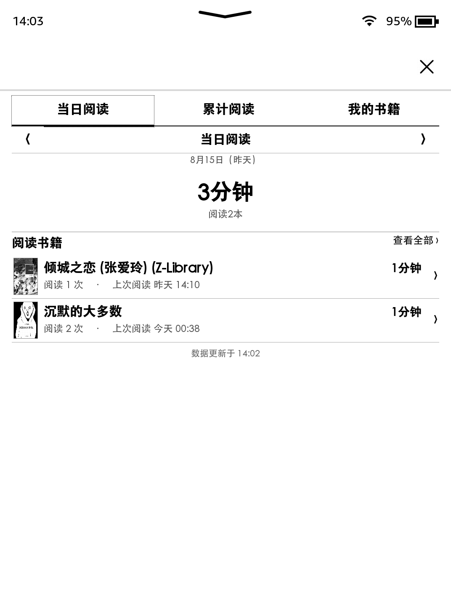
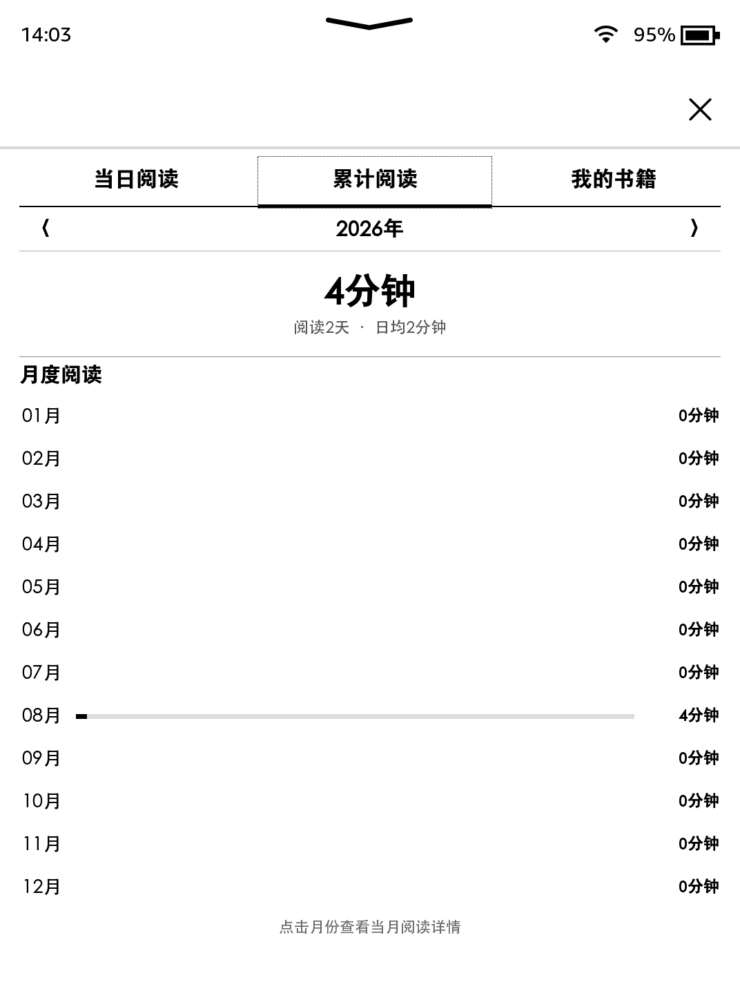
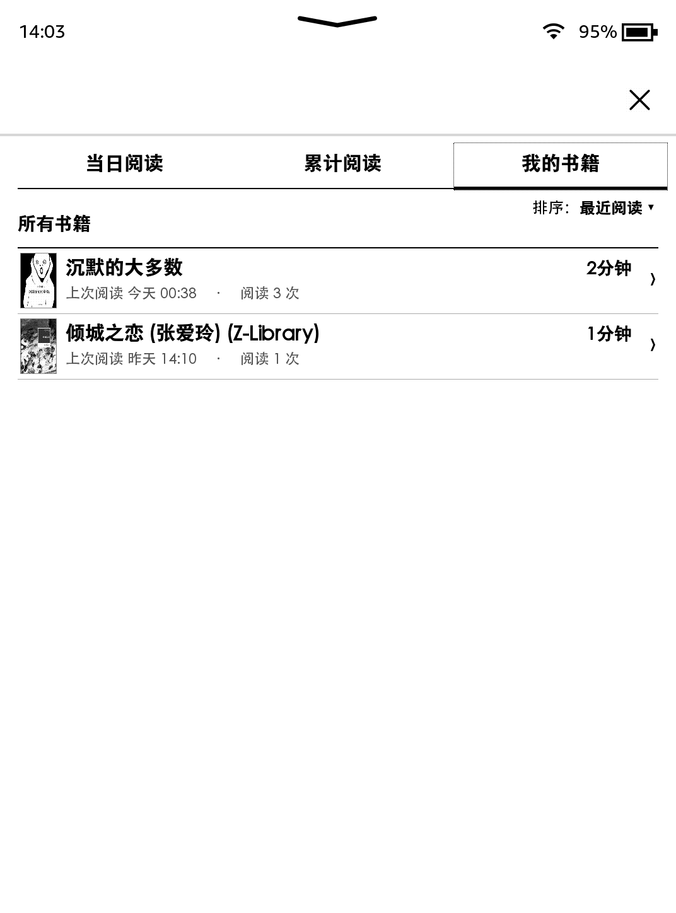

# Kindle Reading Records

一款适用于越狱 Kindle 的轻量阅读记录插件，可在原生系统中查看阅读时长和书籍记录。

> 非 Amazon 官方项目，请确认设备已经越狱并支持运行 `;log runme`。

## 功能

- 查看每日、每月和累计阅读时长
- 按书籍查看阅读记录
- 支持书籍封面、排序、分页，以及“本机书籍 / 全部书籍”切换
- 支持 KUAL 备用启动入口
- 同一 Wi-Fi 内的多台 Kindle 可直接同步，无需手机、电脑或云端
- 自动轮换诊断日志，长期占用控制在约 1 MB
- 自动保留已有阅读数据

## 界面预览

<p align="center">
  
  
  
</p>

## 安装

1. 从 [Releases](../../releases) 下载最新安装包。
2. 解压后，将其中的文件复制到 Kindle 根目录。
3. 安全弹出 Kindle，并断开 USB 数据线。
4. 在 Kindle 搜索框输入：

   ```text
   ;log runme
   ```

5. 等待安装完成，然后从书库打开“阅读记录”。

如果 KPW3、Kindle Voyage 等设备的书库不显示 `ReadingRecords.sh`，可以打开 KUAL，选择“阅读记录”启动。

## 数据

阅读数据保存在：

```text
/mnt/us/reading-time/
```

重新安装或升级不会主动删除已有记录。操作前仍建议备份该文件夹。

## 局域网同步

两台 Kindle 连接同一 Wi-Fi、保持唤醒并同时打开“阅读记录”后会自动同步。重复同步会按事件去重，不会重复累计时长；失败也不会影响本机记录。详见 [局域网同步说明](docs/lan-sync.md)。

## 版本

当前版本：`v1.3.4`（书籍显示范围切换、局域网同步与自动日志清理）
